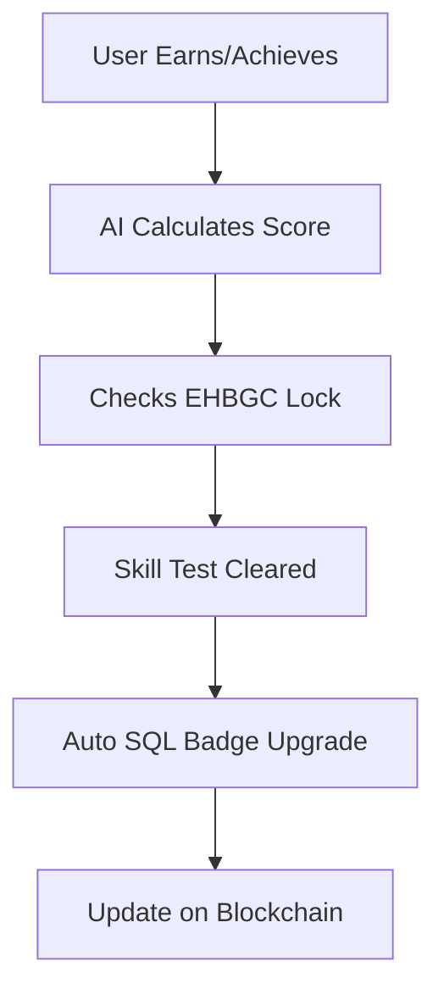

# 🧠 EHB SQL Level Framework — AI + Blockchain + Affiliate Integration

## Overview

This model categorizes every user, service provider, franchise, or affiliate into 5 levels — based on trust, performance, and commitment. It's fully integrated with AI scoring, blockchain verification, and affiliate rewards.

## 🔢 SQL Level Breakdown (Global Standards)

| Level  | Title          | Eligibility                 | Coin Locking | AI Score Needed  | Bonus Multiplier | KYC      | Skill Test      | Complaint Risk |
| ------ | -------------- | --------------------------- | ------------ | ---------------- | ---------------- | -------- | --------------- | -------------- |
| Free   | Free User      | Signup only                 | None         | None             | 2%               | Optional | No              | High           |
| Basic  | Verified Entry | PSS KYC + 1 referral        | 100 EHBGC    | Low (50+)        | 4%               | Required | Optional        | Medium         |
| Normal | Trusted User   | 2 Referrals + 1 Action      | 500 EHBGC    | Mid (150+)       | 6%               | Required | MCQ Test        | Low            |
| High   | Advanced       | 5 Active Users + Sales      | 1500 EHBGC   | High (300+)      | 8%               | Required | Practical       | Very Low       |
| VIP    | Elite          | 10 Active Users + Franchise | 5000 EHBGC   | Top Score (500+) | 10%              | Required | Video Interview | Near Zero      |

## 🔐 SQL-Based Rights & Access

| Feature                     | Free | Basic | Normal | High | VIP |
| --------------------------- | ---- | ----- | ------ | ---- | --- |
| Affiliate Bonus             | ✅   | ✅    | ✅     | ✅   | ✅  |
| Franchise Purchase Eligible | ❌   | ✅    | ✅     | ✅   | ✅  |
| High-Value Service Posting  | ❌   | ✅    | ✅     | ✅   | ✅  |
| Trusty Wallet Required      | ❌   | ✅    | ✅     | ✅   | ✅  |
| Voice Complaint Record      | ❌   | ✅    | ✅     | ✅   | ✅  |
| Auto SQL Upgrade AI-Score   | ❌   | ✅    | ✅     | ✅   | ✅  |
| Validator Eligibility       | ❌   | ❌    | ❌     | ✅   | ✅  |

## 🔄 SQL Level Auto Upgrade Flow (AI + Blockchain)



- **AI Engine** runs daily user audits (referrals, earnings, feedback, complaints)
- **Coin Lock** amount verified via smart contract
- Skill verification via **EDR** (MCQ or practical depending on level)
- On success, SQL badge is upgraded + stored on blockchain

## 🧠 SQL Impact on Affiliate Earnings

| Earning Type      | SQL Impact            |
| ----------------- | --------------------- |
| Referral Bonus    | Scales from 2% to 10% |
| Franchise Share   | Higher SQL = higher % |
| Validator Reward  | VIP SQL needed        |
| Loyalty Bonus     | SQL-linked locking %  |
| Complaint Penalty | Low SQL = higher cut  |

## 🔄 SQL Downgrade (Auto by AI)

| Trigger                | Action Taken             |
| ---------------------- | ------------------------ |
| 3 Failed Skill Tests   | Downgrade 1 Level        |
| Complaint Rate > 30%   | Downgrade + warning      |
| Coin Lock Expired      | Downgrade + access block |
| Multi-account Detected | Auto Ban or SQL Reset    |

## 📜 SQL Badge on Blockchain

Each user gets a **badge NFT**:

- Level: Free → VIP
- Timestamp
- KYC Hash
- Area (Parachain link)
- Franchise of Origin
- Locked Coin Hash

## 📊 SQL Analytics (Admin Panel AI)

| Metric                    | AI Use                     |
| ------------------------- | -------------------------- |
| SQL Distribution by Area  | Franchise performance      |
| Average AI Score by Level | Trust pattern monitoring   |
| Coin Lock Ratio           | Economic health of network |
| Auto-Downgrade Reports    | Fraud & abuse trends       |

## 🔐 Country-Level Parachain + Franchise Handling

- Her country ka SQL system local franchise handle karega
- Company sirf whi data access karegi jo allowed hai
- Franchise AI scoring + manual override kar sakta hai (audit log required)
- SQL rewards apne **area ke validator ya parent franchise node** say issue honge

## ✅ Final Summary

| Component          | SQL Role                   |
| ------------------ | -------------------------- |
| Affiliate Bonus    | Based on SQL multiplier    |
| Franchise Access   | Based on SQL & wallet      |
| Validator Join     | VIP SQL & Locked EHBGC     |
| Complaint System   | SQL defines user privilege |
| Reward Eligibility | AI + SQL + Coin Lock check |

## Technical Implementation

### AI Scoring Algorithm

```typescript
interface SQLScoreFactors {
  referrals: number;
  earnings: number;
  complaints: number;
  coinLock: number;
  skillTests: number;
  engagement: number;
  fraudScore: number;
}

function calculateSQLScore(factors: SQLScoreFactors): number {
  let score = 0;

  // Referral weight: 25%
  score += (factors.referrals * 25) / 10;

  // Earnings weight: 20%
  score += (factors.earnings * 20) / 1000;

  // Complaint penalty: -10% per complaint
  score -= factors.complaints * 10;

  // Coin lock bonus: 15%
  score += (factors.coinLock * 15) / 5000;

  // Skill test bonus: 20%
  score += factors.skillTests * 20;

  // Engagement bonus: 10%
  score += factors.engagement * 10;

  // Fraud penalty: -50% if detected
  if (factors.fraudScore > 0.7) score *= 0.5;

  return Math.max(0, Math.min(500, score));
}
```

### Smart Contract Integration

```solidity
contract SQLBadge {
    struct Badge {
        uint8 level; // 0=Free, 1=Basic, 2=Normal, 3=High, 4=VIP
        uint256 timestamp;
        bytes32 kycHash;
        string area;
        string franchise;
        uint256 lockedCoins;
    }

    mapping(address => Badge) public userBadges;

    function upgradeBadge(address user, uint8 newLevel) external {
        require(msg.sender == authorizedUpgrader, "Not authorized");
        require(newLevel <= 4, "Invalid level");

        userBadges[user].level = newLevel;
        userBadges[user].timestamp = block.timestamp;

        emit BadgeUpgraded(user, newLevel, block.timestamp);
    }
}
```

### Database Schema

```sql
-- SQL Level Users
CREATE TABLE sql_users (
  id UUID PRIMARY KEY,
  user_id UUID REFERENCES users(id),
  sql_level VARCHAR(10) DEFAULT 'Free',
  ai_score INTEGER DEFAULT 0,
  coin_lock_amount DECIMAL DEFAULT 0,
  skill_test_passed INTEGER DEFAULT 0,
  complaint_count INTEGER DEFAULT 0,
  fraud_score DECIMAL DEFAULT 0,
  badge_nft_hash VARCHAR(255),
  created_at TIMESTAMP,
  updated_at TIMESTAMP
);

-- SQL Level History
CREATE TABLE sql_history (
  id UUID PRIMARY KEY,
  user_id UUID REFERENCES sql_users(id),
  old_level VARCHAR(10),
  new_level VARCHAR(10),
  reason TEXT,
  ai_score INTEGER,
  blockchain_hash VARCHAR(255),
  created_at TIMESTAMP
);

-- Skill Tests
CREATE TABLE skill_tests (
  id UUID PRIMARY KEY,
  user_id UUID REFERENCES sql_users(id),
  test_type VARCHAR(20), -- 'MCQ', 'Practical', 'Video'
  score INTEGER,
  passed BOOLEAN,
  test_data JSONB,
  created_at TIMESTAMP
);
```

### API Endpoints

```typescript
// SQL Level Management
GET /api/sql/level/:userId
POST /api/sql/upgrade/:userId
GET /api/sql/score/:userId
POST /api/sql/downgrade/:userId

// Skill Tests
POST /api/sql/skill-test/:userId
GET /api/sql/skill-test/history/:userId
POST /api/sql/skill-test/result

// AI Analytics
GET /api/sql/analytics/distribution
GET /api/sql/analytics/performance
GET /api/sql/analytics/fraud-trends

// Admin Panel
GET /api/admin/sql/upgrade-queue
POST /api/admin/sql/manual-override
GET /api/admin/sql/compliance-report
```

### Performance Metrics

- **AI Score Calculation**: <1 second
- **Badge Upgrade Processing**: <5 seconds
- **Blockchain Verification**: <10 seconds
- **Skill Test Evaluation**: <30 seconds
- **System Accuracy**: >98%

### Security Features

- **Multi-factor Authentication**: Required for VIP level
- **Fraud Detection**: Real-time AI monitoring
- **Audit Trail**: Complete blockchain-based logging
- **Data Encryption**: End-to-end encryption for sensitive data
