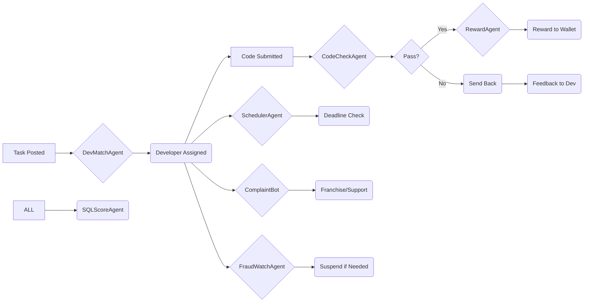

# 🛠️ SOT — Services of Technology (Advanced AI-Based Tech Services Platform)

## 🎯 Core Mission

SOT is EHB's core platform for technology services, including machinery, hardware, software, IT support, and developer-based services. It connects service providers, vendors, and customers via a **decentralized, AI-supported infrastructure** with **verified professionals, automated task management, and blockchain-backed rewards**.

---

## 🔧 Core Mission of SOT

| Goal                                 | Details                                                                                               |
| ------------------------------------ | ----------------------------------------------------------------------------------------------------- |
| ✅ **Verified Technology Providers** | Connect users with verified service providers (repair, installation, programming, etc.)               |
| ✅ **Digital + Physical Service**    | On-site, remote, and hybrid IT & hardware services                                                    |
| ✅ **Developer Marketplace**         | Hire developers, IT teams, or technical support (freelance or full-time)                              |
| ✅ **Franchise-Based Tech Hub**      | Each region/city has its own tech franchise for traffic control, verification, and complaint handling |
| ✅ **Service Category Control**      | All categories follow SQL levels (Free → VIP) with progressive feature unlock                         |

---

## 🧩 Main Modules & Features (AI Enhanced)

### A. User & Service Provider Registration

- KYC (PSS) + Skill Verification (EDR)
- AI skill test: hardware, software, code-based, or tool-specific
- Profile badge: based on SQL + client feedback
- Auto-upgrade suggestions from AI (skill, behavior, rating, earnings)

### B. Tech Service Listings

- Hardware Services: printer, CCTV, laptops, solar, machinery
- Software Services: app dev, web dev, debugging, automation
- Specialized: Robotics, IoT, Blockchain Dev, AI/ML Tasks

### C. AI-Based Smart Matching

- AI detects client need → matches best-suited providers
- Suggests nearby franchise or expert with SQL badge
- Price estimator using category, area, and demand index

### D. Order & Task Management

- Booking dashboard for clients & providers
- Auto-scheduling with calendar sync
- Video calls or physical visit system
- AI logs issue, outcome, time taken → trust score updated

### E. Complaint & Rating Engine

- 1–5 star rating → impacts SQL level
- Complaint auto-routing (Sub → Master → Corporate)
- Fraud detection (ghost service, fake receipts, etc.)
- Franchise fines triggered by AI (delay, fraud, negligence)

### F. Developer/Remote Tech Hiring

- Post requirement (tech stack, budget, duration)
- AI scans profiles, resumes, GitHub, LinkedIn links
- Auto-contract, smart invoice, payment via EHB wallet
- SQL lock-in: Higher level = better payout and priority

---

## 🛠️ SOT Service Categories (Sample)

| Category          | Examples                                                         |
| ----------------- | ---------------------------------------------------------------- |
| ⚙️ Hardware       | Printer Repair, CCTV Setup, Solar Panel, UPS, Industrial Machine |
| 💻 Software       | Website, App, Custom ERP, POS                                    |
| 🧠 AI/ML          | Custom Model Training, Automation Scripts                        |
| 🕹️ IoT & Robotics | Arduino, Raspberry Pi, Sensors, Drone                            |
| 🌐 Networking     | WiFi, Routers, Firewall, IP Setup                                |
| 🧰 Others         | Maintenance, Consultancy, Full Project Delivery                  |

---

## 🏢 Franchise System Integration

- City/District-based franchise = control order & service flow
- Franchise dashboards show:
  - Ongoing services in area
  - Complaint status
  - Performance rating
  - Area income
- Delayed resolution auto-escalates (via AI timer)

---

## 🏆 SQL Level Rules in SOT

| Level  | Limitations                    | Privileges                        |
| ------ | ------------------------------ | --------------------------------- |
| Free   | Limited tools, no verification | View basic jobs                   |
| Basic  | Basic KYC, no EDR              | Can apply to normal services      |
| Normal | EDR + PSS required             | Get listed in suggestions         |
| High   | Verified jobs/projects only    | AI auto-match priority            |
| VIP    | Verified + High Trust Score    | Top visibility + priority payouts |

---

## 🔗 Integration with Other Systems

- 🧠 AI Marketplace: Sell tech scripts, apps, models
- 📚 OBS: Add tech training/courses
- 💼 JPS: Convert gig to long-term job
- 💰 Wallet: Auto-payment + affiliate system
- 🧾 Franchise: Regional profit share, fines, upgrades

---

## 🤖 EHB AI Agent System for SOT

### 🎯 Core Objective

Automate the full lifecycle of developer registration, task management, SQL-level control, and fraud/security analysis **without manual intervention**, using intelligent agents.

### 🧠 AI Agent Roles inside SOT

| Agent Name        | Role Description                                                                        |
| ----------------- | --------------------------------------------------------------------------------------- |
| `OnboardAgent`    | Handles developer registration, PSS KYC, and EDR testing workflow                       |
| `TaskAssignBot`   | Matches tasks to developers based on skillset, history, and availability                |
| `CodeCheckAgent`  | Reviews submitted tasks for plagiarism, AI-generated code, and skill rating             |
| `SQLAuditAgent`   | Calculates performance-based SQL upgrades or downgrades                                 |
| `ComplaintAgent`  | Processes voice/video/text complaints, auto-categorizes, and routes to proper franchise |
| `FraudDetectBot`  | Scans for fake profiles, duplicate accounts, and abnormal login patterns                |
| `RewardAgent`     | Distributes EHBGC rewards based on validator rules, performance, and stake level        |
| `WalletLockAgent` | Locks/unlocks wallet balance based on SQL requirements, fines, and franchise rules      |

### 📈 AI-Based Automation Workflows

#### 🟢 Developer Onboarding

- AI checks KYC via PSS (face + ID match)
- Auto-verifies documents or flags for manual check
- Assigns Free SQL Level by default
- AI schedules EDR test (MCQ, project, code)
- EDR result → SQL badge auto-issued

#### 🟡 Task Lifecycle (Auto Flow)

1. `TaskAssignBot` → Assigns task with deadline & estimated reward
2. Developer submits → `CodeCheckAgent` runs analysis:
   - Code quality
   - Efficiency
   - Time used vs. allowed
   - AI-detection (e.g., GPT-generated warning)
3. Score sent to `SQLAuditAgent`:
   - SQL Score ↑ if passed well
   - SQL Score ↓ if failed or delayed
4. `RewardAgent` pays based on score + locked wallet ratio

#### 🧠 Complaint Handling (Voice, Video, Text)

- User records issue (voice/video/text)
- `ComplaintAgent` runs AI transcription (whisper, NLP)
- Detects:
  - Topic (task, payment, fraud, delay)
  - Sentiment (angry, neutral, frustrated)
  - Urgency (auto-priority flag)
- Routes to correct franchise level
- `SQLAuditAgent` marks dispute record in profile

### 🏆 SQL Level AI Score Breakdown

Each user has a **Trust Index**, **Performance Index**, and **Complaint Index**. AI calculates score on:

| Metric                 | Weight |
| ---------------------- | ------ |
| Task Completion Rate   | 30%    |
| AI Skill Check Score   | 20%    |
| Complaint Flags        | -20%   |
| Peer Review / Feedback | 10%    |
| Wallet Lock (EHBGC)    | 10%    |
| Login Activity         | 10%    |

SQL upgrade thresholds:

- Free → Basic: 50+
- Basic → Normal: 70+
- Normal → High: 85+
- High → VIP: 95+

### 🔐 Security AI Modules

| Threat                 | Detection Mechanism                      |
| ---------------------- | ---------------------------------------- |
| Multi-accounting       | IP/device/browser fingerprint AI model   |
| Plagiarized Code       | Code similarity graph (AST-based check)  |
| Fake Tasks/Submissions | Pattern match + time anomaly             |
| Login Fraud/VPN Use    | Location inference + VPN DB comparison   |
| Complaint Misuse       | Voice tone + frequency + abuse detection |

---

## 🖼️ UI/UX Structure (Advanced AI-Based)

### 🎯 Objective

To allow global developers, tech companies, and clients to **easily connect, verify, assign, and manage** software and tech service tasks.

### 🖼️ A. Landing Page UI Layout

| Section            | Details                                                                                |
| ------------------ | -------------------------------------------------------------------------------------- |
| Hero Banner        | "Connect with Verified Developers Worldwide" — CTA: [Get Started] [Become a Developer] |
| Service Categories | Web Dev, Mobile App, AI/ML, IoT, Blockchain, Repair Services, etc.                     |
| AI Highlights      | "Powered by AI Agents" — Task Matching, KYC, SQL Rating, Auto Payment                  |
| Live Counters      | Tasks completed, Developers registered, Countries served                               |
| Top Profiles       | Verified top developers with SQL badges                                                |
| Footer             | About, Policies, Contact, Download App, Social links                                   |

### 🧑‍💻 B. User Dashboard (Developer View)

| Section          | Description                                                         |
| ---------------- | ------------------------------------------------------------------- |
| Profile Card     | Picture, SQL Level, Wallet Status, Trust Score                      |
| Task Board       | - Available Tasks (with AI match %) - In Progress - Completed |
| Skill Upgrade    | - EDR Practice  - Scheduled Tests                                |
| AI Agent Chat    | Ask questions, get job insights, or file complaints                 |
| Complaint Center | Submit voice/text/video issue                                       |
| Affiliate Tab    | Invite link, stats, earnings                                        |

### 🧑‍💼 C. Client Dashboard (Task Giver View)

| Section          | Description                                |
| ---------------- | ------------------------------------------ |
| Post New Task    | AI helps draft task + budget + timeline    |
| Active Tasks     | See matched devs, progress, reports        |
| History          | Completed tasks, payment logs              |
| Fraud Check      | Flagged devs, trust analytics              |
| Franchise Rating | How many devs from which area perform best |

### 🧭 Dashboard Layout

| Section            | Components                                                                                     |
| ------------------ | ---------------------------------------------------------------------------------------------- |
| **Top Navigation** | Logo, Wallet Status, Notifications, Language Switcher                                          |
| **Left Sidebar**   | Home, My Projects, AI Commands, Skill Tests, Tasks, Complaints, Wallet, Profile & SQL, Support |
| **Main Panel**     | Context-sensitive display (AI output, code editor, logs, suggestions, etc.)                    |
| **Right Sidebar**  | AI Suggestions, Project Status, Warnings & Logs, Tips / Recommended SDKs                       |

### 🧩 Component-Level UI Breakdown

#### A. AI Command Panel

- Prompt input (chat + voice)
- Suggested actions ("Build login system", "Connect MongoDB", etc.)
- Quick copy/export buttons
- "Explain this code" button for AI breakdown

#### B. Code Workspace

- Language tabs (React, Python, Solidity, etc.)
- Live preview
- Error highlighter (red underline)
- Test result view

#### C. Task Manager

- Milestone list
- Status: Not started / In Progress / Done
- Estimated time remaining
- AI Notes per task

#### D. Wallet & Rewards

- Locked EHBGC balance
- Earned tokens today/week/month
- Loyalty reward progress bar
- Upgrade to unlock advanced AI button

#### E. Voice Assistant (Floating Mic)

- Tap to speak: "Make REST API in Node.js"
- Converts to command + executes
- Logs stored under interaction history

### 💬 Modal Windows (Popups)

| Modal                | Purpose                            |
| -------------------- | ---------------------------------- |
| KYC Upload           | PSS + EDR document, face scan      |
| Skill Test Window    | Time-bound challenge with AI check |
| Complaint Submission | Record voice/video or type         |
| Payment Breakdown    | Task-level reward & penalty report |
| Code Export          | GitHub, Replit, ZIP, Clipboard     |

### 📱 Mobile Optimization (Essential Panels Only)

- Projects
- AI Chat
- Wallet
- Tasks
- Voice Command
- Notifications

### 🧠 AI-Specific Enhancements

| Feature           | Function                               |
| ----------------- | -------------------------------------- |
| Smart History     | Auto-save every session with summary   |
| Resume Builder    | Auto-generate resume from project logs |
| Code Clarity Mode | Simplified explanation of current file |
| Dark/Light Toggle | Code-optimized visual theme switch     |

---

## 🧠 Backend Logic Flow

### 🧱 Tech Stack

- **Backend**: Node.js + Express
- **Database**: MongoDB (Developer DB, Tasks DB, Complaint DB, Logs DB)
- **Blockchain**: Moonbeam (EHBGC wallet tracking + reward payout)
- **Authentication**: JWT + OTP + Face Scan
- **AI Agent Layer**: Python microservices + LangChain

### 🗃️ Core Backend Modules

| Module               | Functions                                      |
| -------------------- | ---------------------------------------------- |
| KYC Module           | Selfie, Document Scan, PSS Integration         |
| EDR Module           | Skill Testing, Scoring, Scheduling             |
| Task Matching Engine | Skill match %, availability logic              |
| Reward Engine        | Based on task quality + SQL level + EHBGC lock |
| Complaint System     | AI transcription, routing, escalation logic    |
| Fraud Watch          | Monitoring, warnings, automated flags          |
| Affiliate Manager    | Tree structure, earnings, coin payouts         |

### 🔌 Main API Endpoints

#### 📁 1. User & Session

| Method | Endpoint            | Description                       |
| ------ | ------------------- | --------------------------------- |
| `POST` | `/api/sot/register` | Developer registration (with SQL) |
| `POST` | `/api/sot/login`    | Login + 2FA (Trusty Wallet check) |
| `GET`  | `/api/sot/profile`  | Fetch developer profile           |
| `POST` | `/api/sot/logout`   | End session securely              |

#### ⚙️ 2. AI Task System

| Method | Endpoint                         | Description                             |
| ------ | -------------------------------- | --------------------------------------- |
| `POST` | `/api/sot/ai-agent/ask`          | Send prompt or code for AI response     |
| `POST` | `/api/sot/ai-agent/voice-upload` | Upload voice → AI converts to text/code |
| `POST` | `/api/sot/ai-agent/ui-builder`   | Send layout prompt → UI HTML/React      |
| `GET`  | `/api/sot/ai-agent/history`      | View task logs & outputs                |
| `POST` | `/api/sot/ai-agent/feedback`     | Submit stars & comment                  |

#### 💼 3. Job Board / Project Flow

| Method | Endpoint                        | Description                     |
| ------ | ------------------------------- | ------------------------------- |
| `GET`  | `/api/sot/projects/list`        | List of available SOT jobs      |
| `POST` | `/api/sot/projects/apply`       | Apply to a project              |
| `GET`  | `/api/sot/projects/track`       | See application status          |
| `POST` | `/api/sot/projects/upload-task` | Submit final work for client    |
| `POST` | `/api/sot/projects/reward`      | Trigger reward in Trusty Wallet |

#### 🧪 4. EDR Integration for Skill Tests

| Method | Endpoint                   | Description                     |
| ------ | -------------------------- | ------------------------------- |
| `POST` | `/api/sot/edr/quiz/start`  | Start skill-based quiz          |
| `POST` | `/api/sot/edr/quiz/submit` | Submit quiz for AI grading      |
| `GET`  | `/api/sot/edr/status`      | View SQL level upgrade progress |

#### 🛡️ 5. Security, Abuse & Fraud Detection

| Feature             | Logic                                    |
| ------------------- | ---------------------------------------- |
| SQL-Based Access    | SQL level checks per API access          |
| Token Throttling    | Limit requests for low-tier users        |
| Multi-Device Lock   | Notify + auto-disable if misuse detected |
| AI Misuse Flags     | Track toxic inputs / copy-paste abuse    |
| Voice Scan Security | Match uploaded voice vs. KYC voice print |

### 📦 Database Collections

- `users`
- `sot_ai_tasks`
- `ai_feedback`
- `project_applications`
- `wallet_rewards`
- `edr_scores`
- `fraud_flags`

### 📍 Microservices (Optional Expansion)

- 🔄 **AI Caching Layer** for recent prompts/responses
- 🎙 **Voice Processing Microservice**
- 📈 **SQL Analytics Tracker**
- 💼 **Job Matcher Service (AI ranking engine)**

---

## 🛠️ Admin Panel (Company View)

### 🧭 Admin Panel Structure

| Module                        | Description                                                                  |
| ----------------------------- | ---------------------------------------------------------------------------- |
| **Dashboard**                 | Shows total developers, projects, completed tasks, and active AI sessions    |
| **Franchise Overview**        | Tracks area-wise developers, pending KYC, SQL progress                       |
| **AI Usage Logs**             | Logs every AI prompt used by each developer, response time, quality          |
| **Verification Panel**        | Manual/AI-based review of submitted tasks and developer re-verifications     |
| **Income Distribution**       | Displays rewards paid, pending coins, franchise earnings per area            |
| **Complaint & Fraud Monitor** | Detects abuse (e.g., prompt abuse, fake task submissions), routes complaints |

### 📊 SOT Analytics & KPIs

| Metric                     | Description                                 |
| -------------------------- | ------------------------------------------- |
| AI Prompt Quality Score    | Based on developer feedback + output usage  |
| Developer Skill Growth     | Tracks test history, re-scores via EDR      |
| SQL Upgrade Rate           | How many developers advanced per week/month |
| Task Completion Time       | Avg time per job, per SQL level             |
| Franchise Activity Heatmap | Shows active/inactive developer zones       |

### 🧾 Admin Controls

| Control                    | Function                                                  |
| -------------------------- | --------------------------------------------------------- |
| 🚫 Ban Developer           | Manual/AI-triggered ban from panel                        |
| 🟢 Approve Re-verification | Check EDR + task submission → approve SQL                 |
| 💸 Release Payment         | Coin distribution with bonus if locked balance maintained |
| 🛠️ Assign Tasks            | Assign tasks directly to VIP/High SQL devs                |
| ⚠️ Warn Franchise          | If franchise is inactive or poor performance logged       |

### 🧑‍💻 Franchise Role in Admin Panel

| Feature                 | Franchise View                      |
| ----------------------- | ----------------------------------- |
| Developers by Area      | List of all devs under their region |
| Task Monitoring         | See ongoing/pending task status     |
| Complaint Resolution    | Handle low-tier support issues      |
| Re-verification Request | Approve/disapprove SQL movement     |
| Reward Split            | View % of income from dev activity  |

### 🔐 Admin Security & Logs

- **All actions recorded on blockchain log** (coin distribution, SQL change)
- **Admin-only dashboard uses MFA login + Trusty Wallet verification**
- **Smart Audit Trail**: Flags abnormal activity or SQL jumps
- **Data residency enforced**: Each admin sees only their country/region unless global HQ

---

## 🔁 User Flow (SQL-Based AI System)

### 🧑 Developer:

1. Register → KYC via PSS → SQL assigned
2. EDR Test (AI-checked) → Upgrade eligibility
3. Get tasks via AI (Skill match + past performance)
4. Submit → AI check (code quality, time)
5. Reward → EHBGC wallet (based on SQL + review)
6. SQL auto-upgrade → Badge earned
7. Daily login → Activity score tracked
8. Complaint or issue? → AI routes to right franchise

### 🧑 Franchise:

1. View all area developers
2. Approve/reject PSS complaints
3. Respond to escalated cases
4. Analyze area health → dead zone alerts
5. Get reward if zone performance improves

### 🧭 Developer Workflow (AI-Based Process)

| Step | Action                         | Description                                                              |
| ---- | ------------------------------ | ------------------------------------------------------------------------ |
| 1️⃣   | **Login + KYC Verification**   | Secure login, Trusty Wallet check, and PSS-based verification            |
| 2️⃣   | **Skill Validation via EDR**   | Practical test (coding, UI/UX, logic tasks); score used for SQL          |
| 3️⃣   | **Profile Building**           | Developer fills bio, languages, skills; AI gives optimization tips       |
| 4️⃣   | **Project Application**        | Apply to open SOT projects or receive direct invites                     |
| 5️⃣   | **AI Agent Access**            | Ask questions, generate code/UI/data, get guidance                       |
| 6️⃣   | **Voice or Video Prompting**   | Submit audio/video ideas; AI generates complete module or code           |
| 7️⃣   | **Task Submission & Feedback** | Upload work, receive AI or client feedback                               |
| 8️⃣   | **Reward Distribution**        | On approval, coin released to Trusty Wallet (with bonus if SQL > Normal) |
| 9️⃣   | **SQL Upgrade Triggered**      | Based on performance, re-verification, or franchise referral             |
| 🔁   | **Continuous Feedback Loop**   | AI tracks learning curve, suggests trainings, awards loyalty bonuses     |

### 🏅 SQL-Level Based Access (SOT Developer)

| SQL Level  | AI Access               | Voice Tools    | Job Access                   | Bonus % | UI Tools          | Feedback Reports |
| ---------- | ----------------------- | -------------- | ---------------------------- | ------- | ----------------- | ---------------- |
| **Free**   | Only 5 daily AI queries | ❌             | Basic gigs only              | 0%      | ❌                | ❌               |
| **Basic**  | 20 daily queries        | 🎙 Audio-only  | Verified projects            | 2%      | HTML generator    | Manual only      |
| **Normal** | 100 daily queries       | 🎙 Video+Audio | Medium-level jobs            | 5%      | HTML + React      | Auto + Manual    |
| **High**   | Unlimited AI            | 🎙 Full        | Premium & franchise projects | 8%      | UI/UX AI wizard   | AI-scored        |
| **VIP**    | Unlimited + Priority    | 🎙🎥 Real-time | Direct client access         | 12%     | Full-stack AI IDE | Smart reports    |

### 🧠 Advanced AI Capabilities for Developers

- **AI Code Fixer**: Paste code, get bug-fixed version
- **Smart UI Builder**: Describe layout → get HTML/CSS/React
- **Voice-to-Code**: Speak logic → generate backend/frontend script
- **Resume & GitHub Analyzer**: AI recommends project matches
- **Dev Wallet Tracker**: See pending payments, EHBGC reward level

### 🚫 AI Agent Misuse Detection (Auto System)

- Detects: ✖️ Copy-paste abuse, 🚫 repeated irrelevant prompts, 🔁 bot-like behavior
- Action: ⚠️ Warning → ❌ SQL Downgrade → 🔒 Temp Ban
- Franchise gets notified for manual review

---

## 🔐 Security & Compliance

- JWT for session security
- Blockchain logs for SQL history
- Encrypted KYC storage
- AI monitors copy-paste, multi-login, VPN misuse
- Data residency enforced by parachain → Corporate only sees allowed fields
- Auto-ban on repeated suspicious flags

---

## 🧭 Agent Integration Flow in SOT

---

## 🔐 Data Security & Audit

- **Every agent's action is logged with timestamp**
- **All SQL changes, fraud warnings, and rewards are saved on-chain**
- **Agents cannot manipulate final SQL manually – they only recommend**
- **Admin can only override via multi-signature approval system**

---

## 🛠️ Agent Tech Stack Summary

| Agent | Backend          | AI/ML Model           | Storage/Memory       |
| ----- | ---------------- | --------------------- | -------------------- |
| All   | Node.js + Python | GPT-4, Codex, Whisper | MongoDB, Redis, IPFS |

---

## ✅ SOT System Summary

| Layer       | Tech/Feature                                 |
| ----------- | -------------------------------------------- |
| Frontend    | React + Tailwind + AI Chat UI                |
| Backend     | Node.js + MongoDB + AI Verification Layer    |
| Admin Panel | Franchise-based + Analytics + Complaint mgmt |
| AI Layer    | Task assignment, fraud detection, grading    |
| Security    | Blockchain logs + SQL rules + Parachain      |

---

## 🚀 Future Expansion Plans

- **SOT Project Marketplace** (freelance + company biddings)
- **Developer Ranking System** (Global Leaderboard + XP)
- **SOT API Generator** (AI builds SDKs based on user idea)
- **Integration with GitHub Copilot, Replit AI, and Blockchain SDKs**
- **Multi-language AI Assistant with auto-translation**
- **Auto-node setup via Cursor AI Agent (validator-as-a-service)**
- **Validator NFT badges (proof of reputation)**
- **Geo-validator network (Asia, Africa, EU, etc.)**
- **Carbon-neutral validator certification**
- **Validator DAO formation (governance, proposal voting)**

---

## 📌 Integration with EHB Ecosystem

- 🧠 **AI Marketplace**: Sell tech scripts, apps, models
- 📚 **OBS**: Add tech training/courses
- 💼 **JPS**: Convert gig to long-term job
- 💰 **Wallet**: Auto-payment + affiliate system
- 🧾 **Franchise**: Regional profit share, fines, upgrades
- 🛒 **GoSellr**: Tech product sales and software licensing
- 📊 **WAPOS**: Payment processing and financial management
- 🔗 **Affiliate Program**: Referral-based tech service commissions

---

## 🎯 Conclusion

The **EHB AI Agent under SOT** is one of the most advanced AI models in the entire ecosystem. It can function as:

- 💡 Developer IDE + PM + Trainer
- 🔍 QA Tester + Deployment Tool
- 🧠 Career Advisor + Code Teacher
- 🔗 Blockchain Verifier + Reward Distributor

**SOT** is a unique, AI-first, blockchain-secured tech service platform — combining local physical services with global-level software and AI development — all powered by **verified tech experts, regional franchises, and token-based loyalty.**
